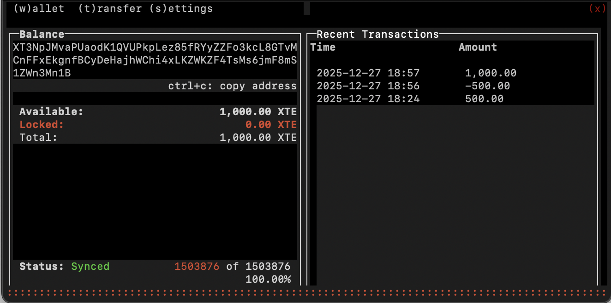

# TRAAITT CLI Wallet

[](https://github.com/TRRXITTE/traaitt/blob/master/docs/XTE.png)

A fast, lightweight Terminal User Interface (TUI) wallet for TRAAITT [XTE] cryptocurrency.

**traaitt [XTE]** - A fast, easy to use and private decentralized cryptocurrency.



## Features

- ✅ **Fast Sync** - Optimized for rapid blockchain synchronization
- ✅ **Terminal Interface** - Efficient TUI using the blessed library
- ✅ **Secure** - Password protected wallets with mnemonic seed backup
- ✅ **Complete** - Send, receive, and manage your XTE
- ✅ **Private** - Run your own node or use public RPC daemons
- ✅ **Cross-platform** - Works on Linux, macOS, and Windows

## Quick Start

### Prerequisites

- Node.js (v12 or higher)
- npm (comes with Node.js)

### Installation

#### Option 1: Global Installation (Recommended)

```bash
npm install -g xte-cli-wallet-nodejs
traaitt-wallet
```

#### Option 2: From Source

```bash
# Clone the repository
git clone https://github.com/trrxitte/xte-cli-wallet-nodejs.git
cd xte-cli-wallet-nodejs

# Install dependencies
npm install

# Build the wallet
npm run build

# Start the wallet
npm start
```

## Usage

### Creating a New Wallet

1. Run `traaitt-wallet` (or `npm start` if running from source)
2. Press `c` to create a new wallet
3. Enter a wallet name and password
4. **IMPORTANT:** Write down your 25-word mnemonic seed and store it safely

### Opening an Existing Wallet

1. Run `traaitt-wallet`
2. Press `o` to open an existing wallet
3. Enter your wallet name and password

### Importing a Wallet

1. Run `traaitt-wallet`
2. Press `i` to import
3. Choose from:
   - **(s)eed** - Import from 25-word mnemonic
   - **(k)eys** - Import from private spend/view keys

### Wallet Operations

- **Send XTE**: Navigate to the Transfer tab using arrow keys or Tab
- **View Transactions**: See recent transactions in the Wallet tab
- **Copy Address**: Press `Ctrl+C` in the Wallet tab
- **Backup Keys**: Go to Settings tab to view private keys and mnemonic

### Keyboard Shortcuts

- `Tab` / Arrow keys - Navigate between tabs
- `Enter` - Confirm / Submit
- `Ctrl+C` - Copy wallet address
- `x` or `Esc` - Exit / Go back

## Configuration

The wallet connects to the TRAAITT network using:
- **RPC Daemon**: main.trrxitte.com:14485
- **Network**: TRAAITT Mainnet
- **Currency**: XTE (TRAAITT)
- **Decimals**: 2

### Wallet Files

- **Location**: `~/.xte-cli-wallet/`
- **Wallets**: `~/.xte-cli-wallet/wallets/`
- **Logs**: `~/.xte-cli-wallet/logs/`

## Performance

### Fast Sync Mode

The wallet is configured for maximum sync speed:
- Processes 100 blocks per tick
- Skips transaction processing during sync
- Minimal logging overhead
- Optimized for rapid initial synchronization

### First-Time Sync

- **From Genesis**: May take 30-60 minutes depending on network speed
- **From Recent Height**: Use scan height to sync from current block (instant)

**Pro Tip**: Import wallets with a scan height set to current network height to skip historical sync:
```bash
./create-fresh-wallet.sh  # Get current height
# Then import with that height
```

## Troubleshooting

### Sync Issues

If sync appears stuck:

```bash
# Diagnose sync status
./diagnose-sync.sh

# Clean start (removes wallet files - backup first!)
./clean-start.sh
```

### Common Issues

1. **"Error: This call is not supported on the cache api"**
   - Fixed in v0.3.2 - update to latest version

2. **Sync stuck at specific block**
   - Import wallet with current scan height to skip problematic blocks
   - See `./create-fresh-wallet.sh`

3. **Connection issues**
   - Verify RPC daemon is accessible: `nc -zv main.trrxitte.com 14485`
   - Check logs: `tail -f ~/.xte-cli-wallet/logs/xte-wallet.log`

## Development

### Build from Source

```bash
# Install dependencies
npm install

# Compile TypeScript
npm run build

# Run tests
npm test

# Start development version
npm start
```

### Project Structure

```
├── src/
│   └── wallet.ts          # Main wallet code
├── dist/                  # Compiled JavaScript
├── screenshots/           # UI screenshots
├── clean-start.sh        # Wallet cleanup utility
├── diagnose-sync.sh      # Sync diagnostic tool
└── create-fresh-wallet.sh # Fresh wallet helper
```

## Resources

- **Website**: [traaitt.com](https://traaitt.com)
- **Explorer**: [explorer.traaitt.com](https://explorer.traaitt.com)
- **GitHub**: [github.com/trrxitte](https://github.com/trrxitte)
- **Documentation**: [docs.traaitt.com](https://docs.traaitt.com)

## Security

⚠️ **Important Security Notes:**

1. **Never share your private keys or mnemonic seed**
2. **Always backup your wallet files and mnemonic**
3. **Use strong, unique passwords**
4. **Verify addresses before sending transactions**
5. **Keep your wallet software updated**

## License

GPL-3.0 License

Original codebase: Copyright ExtraHash 2019
TRAAITT adaptation: 2024

Based on [turtlecoin-wallet-nodejs](https://github.com/turtlecoin/turtlecoin-wallet-nodejs)
Powered by [@trrxitte/xte-wallet-backend](https://www.npmjs.com/package/@trrxitte/xte-wallet-backend)

## Contributing

Contributions are welcome! Please feel free to submit pull requests or open issues.

## Changelog

### v0.3.2 (Latest)
- ✅ Switched to RPC daemon (port 14485) for full compatibility
- ✅ Implemented fast sync mode (100 blocks/tick)
- ✅ Fixed cache API compatibility issues
- ✅ Optimized sync performance
- ✅ Added diagnostic and cleanup utilities
- ✅ Reduced logging overhead
- ✅ Updated branding for TRAAITT

### v0.3.0
- ✅ Initial TRAAITT adaptation
- ✅ Updated to use @trrxitte/xte-wallet-backend
- ✅ Changed daemon endpoint to TRAAITT network
- ✅ Updated UI branding

---

**Made with ❤️ for the TRAAITT community**
